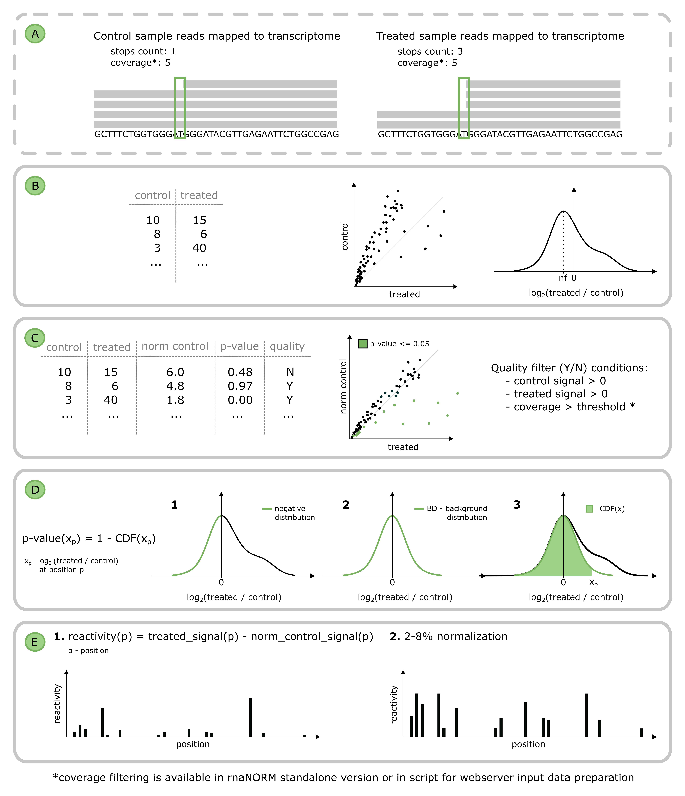

# Welcome to probNORM

A new structural probing signal calculation method that eliminates read distribution bias and prevents reactivity underestimation. It is based on the analysis of background RT stops in treated and control samples of a single replicate and enables statistical discrimination of the probing-sensitive nucleotides. The reactivities obtained by probNORM are highly consistent with the structural models allowing the separation of single- and double-stranded nucleotides.

## The overview of probNORM method

**A.** Counting RT polymerase stops from BAM files (marked with dashed line). 

**B.** The estimation of the distribution of log2 fold changes enables the calculation of the normalization factor (nf). 

**C.** In the background signal after correction, normalized control counts are an approximate value of counts in the treated sample. Only positions meeting the quality filtering criteria are used for further calculations. 

**D.** P-value calculation. 

&nbsp;&nbsp;&nbsp;&nbsp;*1)* The negative part of the log2 fold change distribution is extracted and mirrored on the right side; 

&nbsp;&nbsp;&nbsp;&nbsp;*2)* Next, to the newly formed distribution, probNORM is fitting the gaussian distribution - creating the background distribution (BD); 

&nbsp;&nbsp;&nbsp;&nbsp;*3)* probNORM is calculating the cumulative distribution function to estimate the p-value for each position of the transcript. 

**E.** Transcript reactivity profile. 

&nbsp;&nbsp;&nbsp;&nbsp;*1)* Normalized counts are used for reactivity calculation for each position by subtraction of normalized control signal from treated; 

&nbsp;&nbsp;&nbsp;&nbsp;*2)* The final profile is scaled with 2-8% normalization.  

# Installing probNORM

probNORM can be installed through conda, pypi and from the repository.  

### Required

|              |                                                                                                                                                                                                                                                                                                      |
|--------------|------------------------------------------------------------------------------------------------------------------------------------------------------------------------------------------------------------------------------------------------------------------------------------------------------|
|[**Python**](https://www.python.org):       |version 3.6 or greater (Python 3 is supported). If you’re setting up Python for the first time, the [Anaconda Python distribution](https://www.anaconda.com/products/distribution) is highly recommended.                                                                                                                                  |
|**Libraries**:    |[pysam](https://pysam.readthedocs.io/en/latest/installation.html), [numpy](https://numpy.org/install/), [scipy](https://scipy.org/install/)                                                                                                                                                                                                                                                                                   |
|[**BEDTools**](https://bedtools.readthedocs.io/en/latest/index.html):     |The version is not important, but later versions will have more features so it’s a good idea to get the latest. Follow the instructions at [https://github.com/arq5x/bedtools2](https://github.com/arq5x/bedtools2) to install, and make sure the programs are on your path. That is, you should be able to call bedtools from any directory.|

  
## Conda installation

This is by far the easiest option. If you’re using the Anaconda Python distribution, then the following will install probNORM:

    conda install -c bioconda probNORM

You can also install  probNORM together with BEDTools via conda:

    conda install -c bioconda probNORM bedtools

Both commands will install probNORM from the bioconda/conda channel and automatically makes sure that dependencies are installed.

Otherwise, read on for installation on other platforms and in other environments.
  
## PyPi installation

probNORM is on PyPI under the **probnorm** name, so you can install via pip like most Python packages.

Depending on your Python installation, this may require admin rights:

    pip install probnorm

BEDTools installation:

- via conda:

        conda install -c bioconda bedtools

- via apt-get for Debian like systems:

        sudo apt-get install bedtools

 

## GitHub development version

1. Get probNORM from repository

    Download by clonning this repository:

        git clone https://github.com/zywicki-lab/probNORM.git

    or download a .zip package and unpack it:

        wget https://github.com/zywicki-lab/probNORM/archive/refs/heads/main.zip

        unzip main.zip

2. Install python dependencies:

    You can install them automatically with the following command:

        pip install requirements.txt

    or one-by-one using standard pip installation command, i.e.

        pip install pysam numpy scipy

3. Install BEDtools:

    Following command installs mentioned software system-wide (Debian like systems).

        sudo apt-get install bedtools

  

# Quick start

The main file of probNORM program is **probnorm**. To quickly run probNORM on provided example files type:

    probnorm bam -t example/treated.sorted.bam -c example/control.sorted.bam -o output.txt
for BAM format input, and:

    probnorm counts -i example/counts-input.txt -o output.txt

for count format input.

**This command will run probNORM with the default parameters.**
 

probNORM allows for two format of input data: BAM file or custom made counts file. Depending on the input type, the additional options may vary.

  

# BAM format file

A BAM file (.bam) is the binary version of a SAM file, which is a tab-delimited text file that contains sequence alignment data. These formats are described in details on the SAM Tools web site: [http://samtools.github.io/hts-specs/](http://samtools.github.io/hts-specs/).

The example input BAM files is provided in **example/treated.sorted.bam** and **example/control.sorted.bam**
  

## Options
To show full list of available options with their description type:

    probnorm bam -h
 

### Required

    -t, --treated

    Indexed BAM file for treated sample. If provided file is not indexed, probNORM will prepare it with SAMTools (requires SAMtools installation and increases the execution time)

    -c, --control

    Indexed BAM file for control sample. If provided file is not indexed, probNORM will indexed it with SAMTools (requires SAMtools installation and increases the execution time)

    -o, --output

    The name for the probNORM output file.
 

### Optional

probNORM provides many additional parameters thet allow the detailed adjustment of the algorithm to the analyzed data.

    -id

    probNORM can normalize only selected transcript. Quote transcripts ids in the comma separated list e.g. "RDN18,RDN25".
    Default: all transcripts are normalized.

    -v, --coverage

    Coverage filtering. Only positions with coverage higher than specified are normalized.

    -p, --pvalue

    P-value is the probability that a nucleotide belongs to the background distribution and is not statistically significant.
    Range [0-1]. All positions with a p-value higher than the provided one are rejected from the result.
    Default: 1 -> showing all positions.

    -s, --transcript-size

    Set the percentage of transcript covered with reactive nucleotides. Those positions are further use to set normalization
    parameters. Default: 20 percent of provided transcript.

    -f, --constrain-files

    The constrain files with normalized reactivities for RNAfold [ViennaRNA] and Fold [RNAStructure] will be prepared
    for each normalized transcript. Files will be saved in <output-file-name>_constrains.
 

## Prepare input BAM files

By default the input BAM files should be sorted and indexed for the max optimization of the algorithm. User can do it by running following commands ([SAMtools](http://www.htslib.org/) software is required for this steps).

    samtools sort input.bam -o input_sorted.bam
    samtools index input_sorted.bam

probNORM is able to sort and index provided files, however this step still requires the [SAMtools](http://www.htslib.org/) and significatly increases the execution time.
  

# Counts format file

probNORM input file contains RT polymerase stops counts for both treated and control samples. The file consists of four tab-delimited columns:

1.  Transcript ID

2.  Position

3.  Stops count in the control sample

4.  Stops count in the treated sample

 
It is possible to upload multiple transcripts in one file. probNORM requires a minimum of 20 positions for each transcript to start the normalization process. At least 20% of those should have both control and treated counts higher than zero.

 

The example input counts file is provided in **example/counts-input.txt**
  

## Options
To show full list of available options with their description type:

    probnorm counts -h

### Required

    -i, --input

    The input file listing RT polymerase stops counts for both treated and control samples.
    The file structure is as follows: 
    1. Transcript ID; 
    2. Position; 
    3. Stops count in the control sample;
    4. Stops count in the treated sample;

    -o, --output

    The name for the probNORM output file.

### Optional

probNORM provides many additional parameters thet allow the detailed adjustment of the algorithm to the analyzed data.

    -p, --pvalue

    P-value is the probability that a nucleotide belongs to the background distribution and is not statistically significant.
    Range [0-1]. All positions with a p-value higher than the provided one are rejected from the result.
    Default: 1 -> showing all positions.

    -s, --transcript-size

    Set the percentage of transcript covered with reactive nucleotides. Those positions are further use to set normalization
    parameters. Default: 20 percent of provided transcript.

    -f, --constrain-files

    The constrain files with normalized reactivities for RNAfold [ViennaRNA] and Fold [RNAStructure] will be prepared
    for each normalized transcript. Files will be saved in <output-file-name\>_constrains.
  

## Format

 
The file contains full information about the normalized transcript/s. It consists of nine tab separated columns:
  

| Column name | Description |
|-------------|-------------|
| transcript_id | ID of normalized transcript, the same as in the input file |
| position | Position in transcript |
| stops_treated | Stops count in the treated sample: from input counts file or calculated from BAM file |
| stops_control | Stops count in the control sample: from input counts file or calculated from BAM file |
| stops_norm_control | Normalized stops count in the control sample. Stops are normalized by incorporating the normalization factor (nf). Check The overview of probNORM method point B for more information |
| reactivity | Reactivity, calculated based on the normalized control stops. Check The overview of probNORM method point D for more information |
| fold_change | The ratio between stops counts in control and treated sample |
| p_value | P-value indicates the probability of nucleotide at a given position being a part of the background, not statistically significant. Check The overview of probNORM method point C for more information |
| passed_quality_filter | Quality filter (Y - yes / N - no). Transcript positions that exceed the filtering step are those with stops count higher than zero (both control and treated samples), without any missing parameters, and with proper coverage value (when a local script is determining the stops counts |

    # probnorm counts -i example/counts-input.txt -o output.txt

    transcript_id	position	stops_treated	stops_control	stops_norm_control	reactivity	fold_change	p_value	passed_quality_filter
    RDN18-1	1	3095.0	3472.0	2669.1000000000004	1.0632124544542494	0.2135860512052699	0.37310634695017253	Y
    RDN18-1	2	2029.0	1148.0	882.5250000000001	2.5274855472882036	1.2010598126290937	0.03438625350046609	Y
    RDN18-1	3	315.0	360.0	276.75	0.09548691331973486	0.18676851160572655	0.38858771448505425	Y
    RDN18-1	4	264.0	405.0	311.34375	0.0	-0.23797038886541122	0.6407954148840493	Y
    RDN18-1	5	139.0	171.0	131.45625	0.018832141238058788	0.08050214738573189	0.45145693582080115	Y
    ...
    RDN18-1	1776	0	0	0.0	0.0	0	0.5	N
    RDN18-1	1777	0	0	0.0	0.0	0	0.5	N
    RDN18-1	1778	0	0	0.0	0.0	0	0.5	N
    RDN18-1	1779	0	0	0.0	0.0	0	0.5	N
    RDN18-1	1780	25.0	9.0	6.91875	0.04513784971143676	1.8533447778805348	0.002490274610317811	Y

 

## Summary information

After each use of probNORM the summary of run will be shown. It contains such informations as:

- input file type
- input and output file names
- parameters thresholds: coverage, p-value, reactive positions
- statictics about normalized transcripts
  
See the examples below.
  
BAM input
    
    ***** SUMMARY *****

        input mode: BAM
        input file/s: control: example/control.sorted.bam treated: example/treated.sorted.bam
        output file: test.output
        min coverage: 0
        max p-value: 1.0
        min reactive positions per transcript: 20%
        selected transcripts:  all
        total number of input transcripts: 3
        transcripts omitted due to low reactivity: 0
        transcripts normalized: 3

    *******************
        
COUNTS input

    ***** SUMMARY *****

        input mode: COUNTS
        input file/s: data/counts-input.txt
        output file: test.output
        max p-value: 1.0
        min reactive positions per transcript: 20%
        total number of input transcripts: 2
        transcripts omitted due to low reactivity: 0
        transcripts normalized: 2

    *******************
        
 

# BAM example file

The example input files are prepared from the Mod-seq experiment downloaded from the SRA database (Accessions: SRR955862, SRR955864). Data preparation was performed as follows. The adapter handling step was performed with cutadapt. First, 3’ end adapters were trimmed, reads with 5’ end adapters were removed, and reads shorter than 20nt were discarded from further analysis. The remaining reads were filtered with FASTX-Toolkit to remove low-quality reads, where <80% of bases have quality >20. Next, obtained reads were mapped with bowtie2 to canonical transcripts of Saccharomyces cerevisiae retrieved with BioMart API v84. Sequences with similarity >0.95 were filtered out with CD-HIT. Unique mappings were used for reactivity profile calculation.

From the obtained dataset the 3 RNAs were filtered: RDN25-1, RDN18-1, SCR1 into example files: example/control.sorted.bam and example/treated.sorted.bam

 

# Counts example file

File example/counts.txt contains the three RNAs from Mod-seq experiment above, and two transcripts: 5S in vivo and 5S in vitro from SHAPE-seq 2.0 experiment derived from RNA Mapping DataBase.

 

# Contribution

If you notice any errors and mistakes, or would like to suggest some new features, please use Github's issue tracking system to report it at [probNORM](https://github.com/zywicki-lab/probNORM). You are also welcome to send a pull request with your corrections and suggestions.

 

# License

This project is licensed under the terms of the GNU General Public License v3.0 license.

